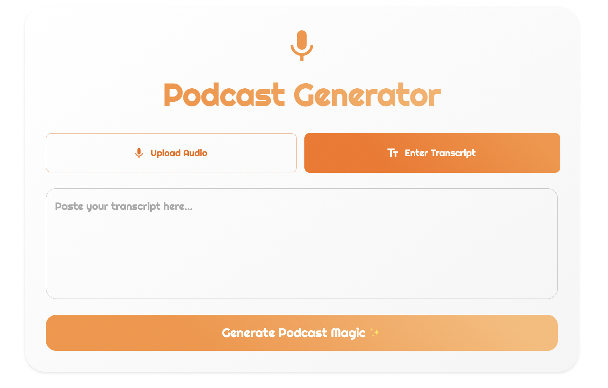

# Podcast Generator Project Brief

## Context
This project will create a prototype similar to [Google's Notebook LM podcast feature](https://notebooklm.google.com/), demonstrating your ability to work with modern web technologies and AI integration.

## Project Overview
You will use generative AI to help you learn concepts and implement a web-based application that converts text transcripts or audio uploads into enhanced, playable podcasts from one or two people using ReactJS, ExpressJS, Google's Gemini API, and Web Speech API. (if you find another AI API more suitable, you can use it instead of Gemini). This prototype will showcase your ability to work with cutting-edge AI and audio processing technologies.

## Project Scope
This is a prototype development project aimed at feasibility and potential of AI-enhanced podcast creation technology used in a real-world application. It is broken into 3 tiers of complexity which are outlined in the [tier.md](tier.md) file. Tier 1 is the minimum viable product and the other tiers are optional and will be used to showcase your ability to work with more complex technologies.

## Core Features Required
- Audio file upload functionality
- Transcript paste/input capability
- Text-to-Audio conversion using Web Speech API or ElevenLabs
- Text transformation using Gemini API or whatever API you want to use for text transformation
- Podcast player interface with basic audio controls (Start, Stop)
- Generate Podcast button control to trigger the podcast creation process
- Example output of generated podcast script in the UI

## Technical Stack
- Frontend: ReactJS
- Backend: ExpressJS
- AI Integration: Google Gemini API
- Audio Processing: Web Speech API
- Audio Compression: Ffmpeg (optional)
- File Uploads: Multer (optional)
- Additional APIs and/or packages as needed

## Project Deliverables
1. Functional full-stack web application prototype
2. Clean source code
3. Documentation

## Evaluation Criteria
- Code quality and organization
- API integration effectiveness
- User interface design
- Error handling and user feedback
- Innovation in implementation

## Don't Panic!
This looks like a lot! Don't worry, let's break it down into manageable chunks. Take a look at the [Session Breakdown](session.md) file for a breakdown of the project and how you could potentially plan to use your time to complete the project. Also take a look at [Example Prompts](example-prompts.md) to understand how to use prompts to help you learn concepts and implement your project.

## Why am I Doing This?
Take a look at the [Learnings and Takeaways](learnings.md) file to understand what you will gain by working on this project. Your goal is to learn, learn, learn more than to complete the project. You will be asked regularly as a professional to learn new concepts and technologies. This is your opportunity to practice.

## Next Steps
1. Review the [technical specification document](spec.md)
2. Research the technologies and tools needed
3. Create a project plan (check out the [Session Breakdown](session.md) for suggestions)
4. Begin development setup
5. Implement the core features
6. Test and iterate on the prototype
7. Reflect on your learning journey

### Documentation

- [Technical Specification Document](./spec.md) - understand the technical requirements and constraints.

- [Learnings and Takeaways](learnings.md) - understand what you will gain by working on this project.

- [Session Breakdown](session.md) - understand how to plan your time to complete the project. Use it as a guide to steer you in the right direction.

- [Prompting Guide](example-prompts.md) - understand how to use prompts to help you learn concepts and implement your project.

- [Tier Options](tier.md) - understand the tiers of complexity you can choose to implement. 

- [Optional Additions](optional-additions.md) - understand how to add additional features to your project to showcase your ability to work with more complex technologies.

- [User Flow Chart](user-flow.md) - understand the user flow and how the application can work.