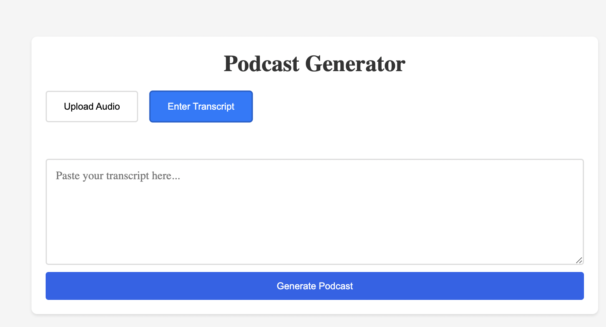

# Project Tiers

## Tier 1

Create a basic podcast generator that allows users to upload a transcript and generate a podcast. Use the Web Speech API to convert the text to audio. Create a basic UI with a play button and a stop button.

- User Can upload a transcript and generate a podcast
- User Can upload an audio file and generate a podcast
- User can play and stop the podcast

See the [spec.md](spec.md) file for more details.

## Tier 2

- add a more robust UI for the player using CSS or framework like Tailwind
- Use ElevenLabs to convert the text to audio and make a more realistic podcast
- Use buffer to store the audio file
- create more than one person podcast

See the [spec.md](spec.md) file for more details.

## Tier 3

- add background music and/or sound effects
- add a more robust podcast player interface with speed control, progress tracking, and a play button
- add a more robust podcast player interface with speed control, progress tracking, and a play button. To view other optional enhancements, please refer to the [optional-additions.md](optional-additions.md) file.